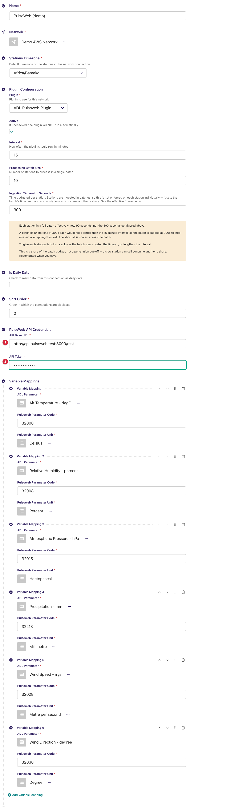
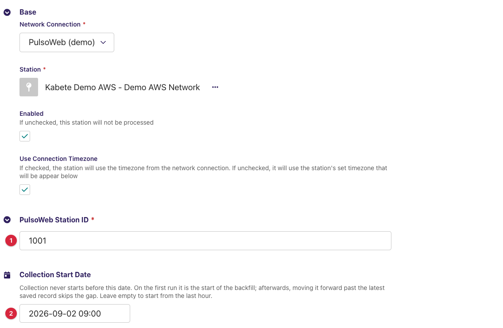
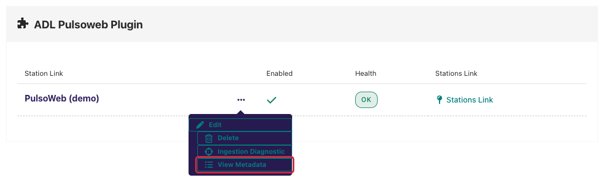
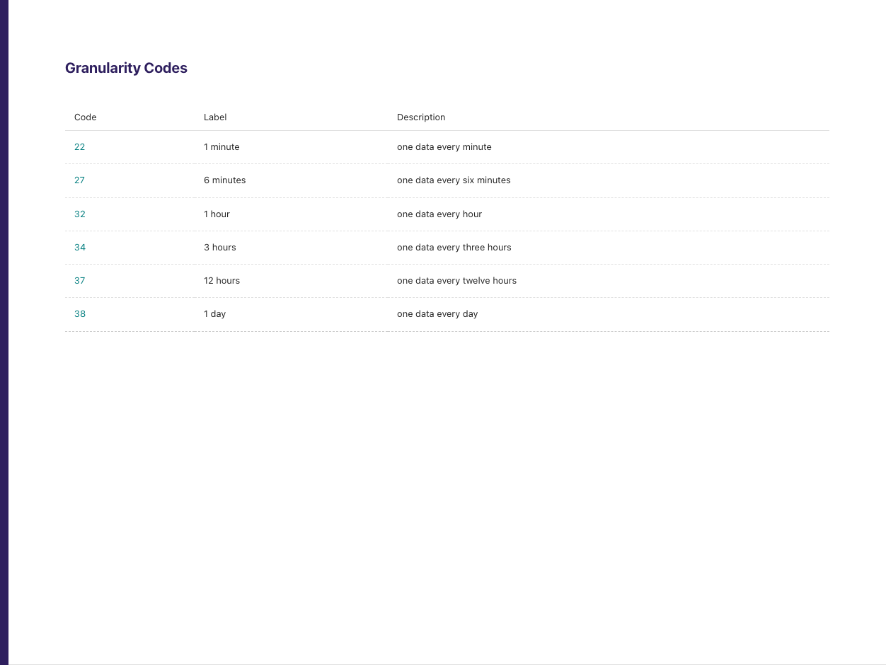
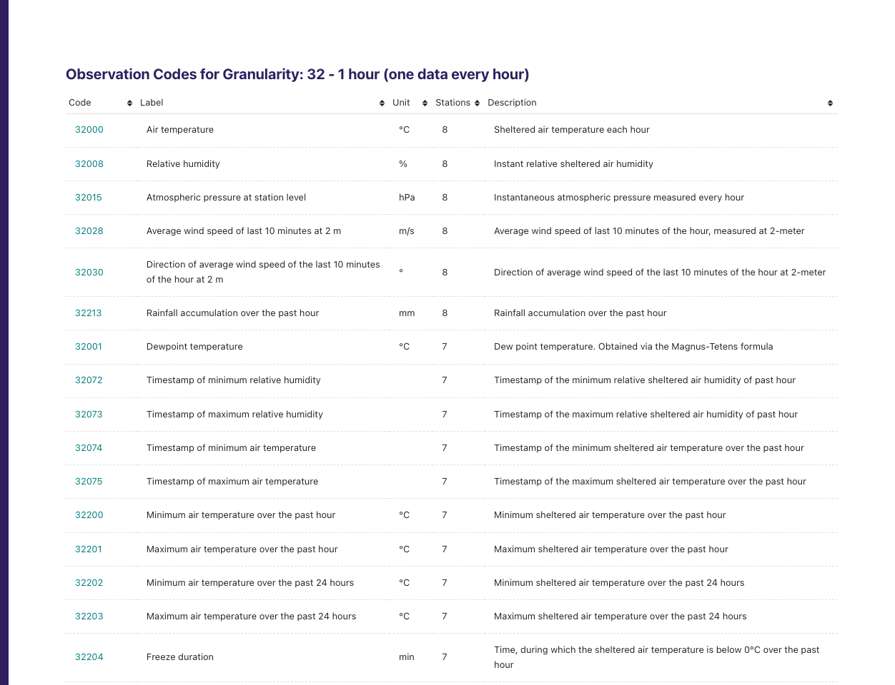
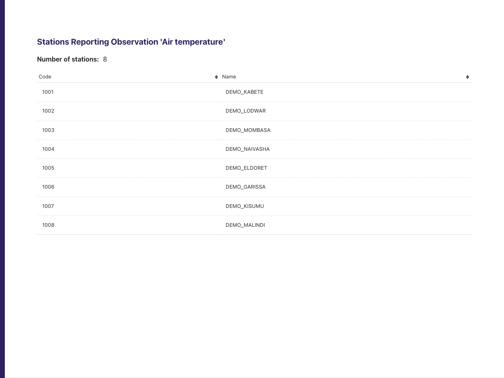
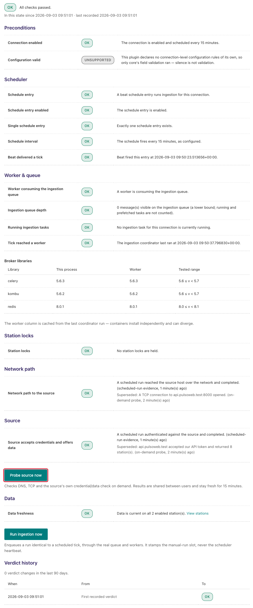
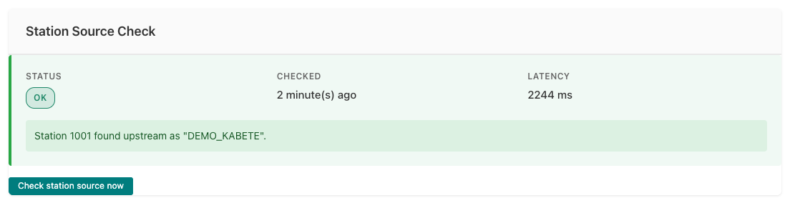

---
adl_plugin:
  name: ADL PulsoWeb Plugin
  connects_to: Pulsonic's PulsoWeb API
  category: general
  choose_when: Your stations use Pulsonic / PulsoWeb.
---
# ADL PulsoWeb Plugin

Collects observation data from **Pulsonic** automatic weather stations through the
**PulsoWeb REST API** and saves it into an ADL instance. This is a *pull* plugin:
on each collection cycle ADL asks the PulsoWeb API for observations per station
over a time window and stores the returned records against your ADL stations
and data parameters.

**Repository:** [adl-pulsoweb-plugin](https://github.com/wmo-raf/adl-pulsoweb-plugin)
**Plugin type identifier:** `adl_pulsoweb_plugin`
**Connection model:** `PulsoWebConnection` · **Station link model:** `PulsoWebStationLink`

> **About the screenshots.** Every image in this guide is regenerated from
> `docs/screenshots.yml` against a seeded demo instance, so hostnames, station
> names, ids and readings in them are placeholders — not values to copy. The
> field tables are the reference for what to enter.

## Overview

PulsoWeb organizes its data as *observations* (variables such as air
temperature or rainfall, each with a code, label and unit) grouped under
*granularities* (time resolutions), measured at *stations* (each with a numeric
station code). The plugin reads this catalogue from the API's `get_context`
endpoint, then fetches observation records per station for the variable codes
you have mapped.

Used operationally by, among others, Mali, Togo, Benin, Congo, Côte d'Ivoire,
Niger, Mauritania and Sierra Leone (see the
[deployments table](https://github.com/wmo-raf/adl#nmhss-using-adl)).

## Prerequisites

- A running ADL instance (see [Installation](https://adl-tool.readthedocs.io/en/latest/installation.html)).
- A **PulsoWeb API token**, issued by Pulsonic for your PulsoWeb account.
- The **API base URL** for your service. The default is
  `https://app.pulsonic.com/rest`; some deployments use a country-specific
  host. The URL should point at the REST root (the plugin calls
  `<base-url>/get_context/` and related paths under it).
- Outbound HTTPS (port 443, or the port in your base URL) from the ADL host to
  that API host — worth checking first on NMHS networks with restrictive
  firewalls.

## Installation

Installed like any ADL plugin — see [Plugin Installation](https://adl-tool.readthedocs.io/en/latest/developer_guide/plugins/plugin_installation.html) for
all methods. The `plugins.toml` entry:

```toml
[[plugins]]
name = "ADL PulsoWeb Plugin"
git  = "https://github.com/wmo-raf/adl-pulsoweb-plugin.git"
tag  = "0.2.0"
```

After rebuild/restart, confirm with `docker compose exec adl list-plugins`.

## Connection configuration

In the ADL admin, create a new **PulsoWeb Connection**. Base connection fields
(name, network, plugin processing settings) are described in
[Manage Connections](https://adl-tool.readthedocs.io/en/latest/user_guide/manage_connections.html). Plugin-specific fields:

| Field | Required | Default | Description |
|---|---|---|---|
| API Base URL | yes | `https://app.pulsonic.com/rest` | Root of the PulsoWeb REST API. Must include scheme and host; a wrong host will surface as a network-level diagnostic failure. |
| API Token | yes | — | The key sent with every API call. Issued by Pulsonic. |



### Variable mappings

Variable mappings are defined **on the connection** and apply to all stations
linked under it. Each mapping ties one PulsoWeb observation code to one ADL
data parameter:

| Field | Description |
|---|---|
| ADL Parameter | The ADL `DataParameter` the values are stored under. |
| Pulsoweb Parameter Code | The observation *code* as PulsoWeb reports it. Find codes in the plugin's metadata explorer (below). |
| Pulsoweb Parameter Unit | The unit the API delivers values in. ADL converts from this unit to the ADL parameter's unit, so it must match what PulsoWeb actually sends — check the unit shown in the metadata explorer. |

**Example:** ADL Parameter `Air Temperature` ← Pulsoweb code `32000` with unit
`°C`.

Codes are numeric and carry their granularity as a prefix: `32000` is hourly
air temperature (granularity `32`, "1 hour"), `22000` the same variable at
one-minute granularity. Take the codes for the granularity your stations
report at — mixing granularities in one connection asks the API for series a
station does not publish, and those variables simply come back empty.

Only mapped codes are requested from the API: a station may offer more
observations upstream, but ADL collects exactly the mapped set.

## Station link configuration

For each station to collect, create a **PulsoWeb Station Link**:

| Field | Required | Default | Description |
|---|---|---|---|
| PulsoWeb Station ID | yes | — | The numeric station *code* on the PulsoWeb side. Find it in the metadata explorer. |
| Collection Start Date | no | empty | Collection never starts before this date, and it must be in the past. On the first run it is the start of the backfill; moving it forward past the latest saved record skips the gap. Leave empty to start from the last hour. |



## The metadata explorer (UI added by this plugin)

Besides its connection and station-link forms, the plugin adds one navigation
surface to the ADL admin: a **metadata explorer** that browses the live
PulsoWeb catalogue for your token. This is where you find every value the
configuration sections above ask for — observation codes, units, and station
IDs — so walk through it once before filling in mappings and station links.

### Entry point — the "View Metadata" link

On the **connections list** (*Connections* in the admin menu), open the
**⋯** menu on the connection's row: besides *Edit*, *Delete* and *Ingestion
Diagnostic* it carries a **View Metadata** entry (list icon). It opens the
explorer in a new browser tab.



### Step 1 — Granularity Codes

The first page lists the *granularities* — the time resolutions your PulsoWeb
service offers — in a three-column table: **Code**, **Label**, and
**Description**. Each code is a link; click the granularity your stations
report at (for most AWS deployments, the minute/hourly one) to see its
observations.



### Step 2 — Observation codes for a granularity

For the chosen granularity, this page lists every observation in a sortable
table: **Code**, **Label**, **Unit**, **Stations** (how many stations report
it), and **Description**.

This is the page variable mappings are built from:

- the **Code** column is what you enter as *Pulsoweb Parameter Code*;
- the **Unit** column is what you select as *Pulsoweb Parameter Unit* — copy
  it exactly, since ADL converts values from this unit;
- the **Stations** count tells you whether a variable is broadly reported or
  only by a few stations.

Each code links onward to the stations reporting it.



The screenshot shows the first rows only; the real table runs to several dozen
observation codes for a typical granularity. Use the column sort to bring the
one you are mapping to the top.

### Step 3 — Stations reporting an observation

For one observation, this page shows the station count and a sortable table of
**Code** and **Name** for every station reporting it. The **Code** column is
the numeric ID you enter as *PulsoWeb Station ID* on the station link — match
stations by name, take the code.



### Notes

- The explorer reads the same cached catalogue the collector uses (cache
  lifetime up to one hour), so a station or variable newly added on the
  PulsoWeb side can take up to an hour to appear here.
- If the explorer pages come up empty or error, fix the connection first — the
  connection-level source check (next section) diagnoses token and URL
  problems, and its feedback catalogue maps each message to a fix.

## Data collection behavior

- **First run (per station):** starts from the *Collection Start Date* if set,
  otherwise from the last hour.
- **Subsequent runs:** continue from the latest saved record; the window ends
  at the top of the current hour in the station's timezone.
- **Backfill:** set *Collection Start Date* in the past before the first run.
- **Timezones:** request windows are computed in the station's timezone and
  sent to the API in `YYYY-MM-DDTHH:MM:SS` form.
- **Request budget:** every API call has connect/read timeouts (10s/60s), so a
  hung source fails the run rather than wedging the worker.

## Source checks / diagnostics

The plugin implements the ADL source-check contracts, so the core's monitoring
screens — described in [Monitoring & Diagnostics](https://adl-tool.readthedocs.io/en/latest/user_guide/monitoring_and_diagnostics.html) — can tell network
faults, credential faults and configuration faults apart *for this connection
specifically*. The screens below are rendered by
the ADL core, but what they display for a PulsoWeb connection comes from this
plugin — this section shows exactly what you will see and what each message
means.

### Where check results appear

**Ingestion Diagnostic page.** From the connections list, the Health column
of your PulsoWeb connection links to its **Ingestion Diagnostic** page
(`/monitoring/connection/<id>/health/`). It shows a layered verdict for the connection —
network reachability of the API host at the bottom, then whether the API
accepted your token and returned data — along with a verdict history. Two
buttons let you check on demand: **Probe source now** re-dials the source
immediately (at most once per minute), and **Run ingestion now** triggers a
full collection cycle — useful right after fixing a token, since a full run
exercises authentication end to end.



**Station Source Check panel.** Open a station link's **Inspect** page (from
the station links list, via the row's "..." menu). Alongside the Collection
Status card — which also offers **Trigger Collection Now** for a manual fetch —
a **Station Source Check** card shows the latest station-level result: a
status badge (OK / FAILED), when it was checked, the latency, and the
message produced by this plugin.



### What each check verifies

| Check | What it verifies |
|---|---|
| Endpoint probe | DNS resolution and TCP reach of the API host/port taken from *API Base URL*. Not run when the base URL has no valid host — fix the URL instead. |
| Connection check | Calls the API's `get_context` fresh (no cache) with your token, and claims OK only from a parsed PulsoWeb response — never from a bare HTTP 200, so a login redirect can't masquerade as success. |
| Station check | Confirms the configured *PulsoWeb Station ID* appears in the source's current station list, also bypassing the cache. |

### Feedback catalogue — messages this plugin produces

Messages name the API host (shown here as `app.pulsonic.com` — yours may
differ) rather than full URLs. Find the message you see:

| Message (example) | Status | Meaning | What to do |
|---|---|---|---|
| `app.pulsonic.com accepted our API token and returned 24 station(s).` | OK | Token valid, catalogue readable. The station count is your account's station list size. | Nothing — healthy. |
| `Station 1234 found upstream as "BAMAKO-SENOU".` | OK | The station ID exists at the source; the upstream name is shown so you can confirm it's the station you meant. | Check the name matches your intended station. |
| `app.pulsonic.com returned HTTP 401 for /rest/get_context/.` | FAILED | The API rejected the token. | Re-enter *API Token* on the connection. |
| `app.pulsonic.com returned HTTP 403 for /rest/get_context/.` | FAILED | Token accepted but lacks permission. | Contact Pulsonic about the account's access. |
| `app.pulsonic.com returned HTTP 404 for /rest/get_context/.` | FAILED | Nothing answers at that path — the base URL points to the wrong place. | Fix *API Base URL* (it must be the REST root). |
| `app.pulsonic.com answered /rest/get_context/ with a body that was not JSON.` | FAILED | Something responded, but not the API — often a proxy page or a login redirect. | Check the base URL and any proxy between ADL and the API. |
| `app.pulsonic.com answered but the response was not a PulsoWeb context.` | FAILED | Valid JSON came back, but not PulsoWeb's catalogue shape. | Confirm the URL is a PulsoWeb REST root. |
| `app.pulsonic.com could not be reached: <error>` | FAILED | Network-level failure: DNS, firewall, or outage. The wrapped error says which. | Check connectivity from the ADL host; see Prerequisites. |
| `Station 1234 was not found in the source's station list.` | FAILED | Positive proof the ID is absent upstream — a typo, or the station was removed/renumbered. | Re-check the ID in the metadata explorer (Step 3). |
| `Could not read the station list from app.pulsonic.com: <error>` | FAILED | The station check couldn't fetch the list, so it proves nothing about this station. | Fix the connection-level failure first, then re-check. |

## Troubleshooting

**Connection check passes but a station collects nothing**
: Confirm the station check passes (the ID exists upstream), then check that
  the mapped observation codes are actually reported by that station — use the
  metadata explorer's stations-per-observation view. A station link whose
  connection maps only codes the station doesn't report yields empty runs.

**Values look numerically wrong (offset or scaled)**
: The *Pulsoweb Parameter Unit* on the mapping doesn't match the unit the API
  delivers; ADL then converts from the wrong unit. Verify against the unit in
  the metadata explorer.

**A newly added upstream station shows "not found"**
: The context cache lasts up to an hour for data collection, but source checks
  bypass it — re-run the check; if it still fails, the station is not in the
  list for your token's account.

**Nothing collected before a certain date**
: *Collection Start Date* is set to that date — collection never reaches
  earlier than it.

## Compatibility

| Plugin version | Requires ADL core | Notes |
|---|---|---|
| 0.2.0 | Core with source-check contracts for full diagnostics | Runs on older cores too; the source-check integration is simply inactive there. |

## Changelog

See [GitHub Releases](https://github.com/wmo-raf/adl-pulsoweb-plugin/releases).
